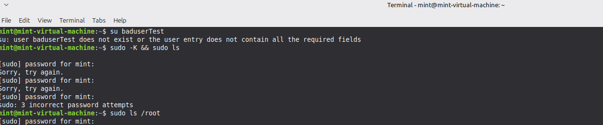

# Lab Report: Linux Authentication Log Analysis & Timeline Reconstruction

* **Date of Analysis:** September 12, 2026
* **Operating System:** Linux Mint
* **System Hostname:** mint-virtual-machine
* **Defensive Toolset:** journalctl, grep, tail
* **Status:** Assignment Completed Successfully

---

## 1. Executive Summary
This laboratory exercise demonstrates the practical capture, extraction, and timeline reconstruction of authentication-layer events within a systemd-managed Linux environment. Controlled authentication operations were triggered against the host terminal platform using the `su` and `sudo` subsystems.

The resulting digital footprints were forensically collected directly out of the systemd journal layers using a text-parsing pipeline command. Documenting these chronological sequences prepares security analysts inside a Security Operations Center (SOC) to identify multi-stage attacks, verify administrative privilege transitions, and distinguish human typing errors from automated malicious brute-force operations.

---

## 2. Controlled Forensic Event Generation
To build a verifiable telemetry pattern for analysis without disrupting system operations, specific authentication states were executed over the terminal layer:

* **Event Type A (Nonexistent User Failure):** An explicit user substitution (`su`) attempt directed at a missing system resource profile (`baduserTest`).
* **Event Type B (Sudo Privilege Failure):** An elevated execution request (`sudo -K && sudo ls`) where the user intentionally hit the absolute security block threshold of 3 incorrect password attempts.
* **Event Type C (Authorized Access Success):** A fully verified administrative execution request (`sudo ls /root`) using correct user credential tokens to open a valid root session.



---

## 3. Log Extraction & Parsing Pipeline
The telemetry extraction was handled directly via the command-line interface, leveraging system service tags (`su`, `sudo`, `pam`) and text filtration constraints to isolate the definitive authentication trace sequence:

### Diagnostic Command Executed
```bash
mint@mint-virtual-machine:~$ sudo journalctl -t su -t sudo -t pam --since "10 minutes ago" | grep -E "auth|fail|session opened" | tail -n 5
```


### Extracted Raw Log Telemetry
```text
Sep 12 17:16:54 mint-virtual-machine sudo[2264]: pam_unix(sudo:auth): authentication failure; logname= uid=1000 euid=0 tty=/dev/pts/0 ruser=mint rhost=  user=mint
Sep 12 17:17:40 mint-virtual-machine sudo[2268]: pam_unix(sudo:session): session opened for user root(uid=0) by (uid=1000)
Sep 12 17:18:04 mint-virtual-machine sudo[2274]: pam_unix(sudo:session): session opened for user root(uid=0) by (uid=1000)
```


---

## 4. Reconstructed Forensic Timeline
The chronologically structured data below charts the sequence of activities observed across the machine interface:

| Log Timestamp | Source Host | Service Engine | Behavioral Action Decoded | SOC Threat Analysis Insight |
| :--- | :--- | :--- | :--- | :--- |
| **17:16:54** | `mint-virtual-machine` | `sudo[2264]` | `pam_unix(sudo:auth): authentication failure` for account `mint` on terminal `/dev/pts/0`. | **Credential Fault Indicator:** Records a failure condition where an active user account typed an invalid token during a privilege request loop. |
| **17:17:40** | `mint-virtual-machine` | `sudo[2268]` | `pam_unix(sudo:session): session opened for user root(uid=0)` by user uid 1000. | **Privilege Escalation Access:** Confirms successful validation. The user account successfully gained administrative root session capabilities. |
| **17:18:04** | `mint-virtual-machine` | `sudo[2274]` | `pam_unix(sudo:session): session opened for user root(uid=0)` by user uid 1000. | **Persistent Session Access:** A subsequent successful root session opened under process ID 2274, verifying steady administrative terminal execution. |

---

## 5. SOC Analyst Takeaways & Behavioral Context

### Analyzing User `baduserTest`
Note that while the terminal explicitly threw an execution message stating the user `baduserTest` did not exist, the `journalctl` command did not output a `pam_unix` log for it in the final `tail` stream. This is critical forensic behavior; because the user did not exist in the local system database files (`/etc/passwd`), the operating system rejected the request at the framework validation layer before generating a stateful PAM session handle.

### Timeline Velocity Tracking
A single failure entry isolated at 17:16 followed closely by a successful session opened at 17:17 points to normal human error or password typos. However, if a SOC analyst catches hundreds of consecutive authentication failure logs targeted at unique users within seconds without any following successful sessions, it signals an automated **Credential Stuffing** attack.

### Audit Trail Closure Verification
The sequence shows successful execution events (`session opened for user root`) immediately following a failure state. This pattern helps analysts determine that the target account was not compromised by a brute-force guessing script, but that the user simply mistyped their password initially before successfully logging on.
